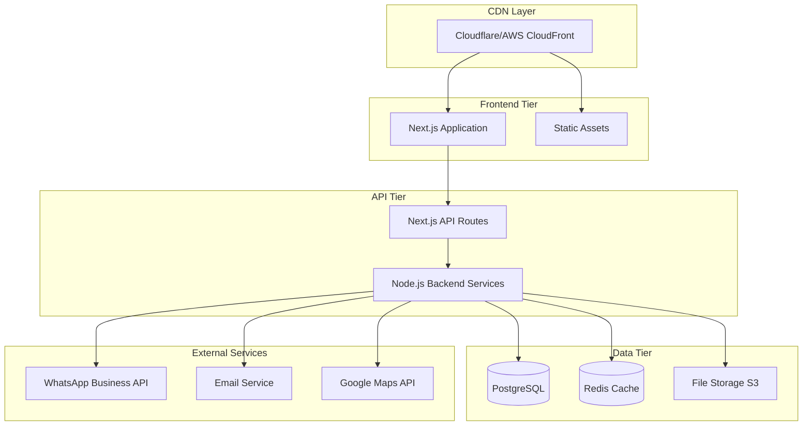
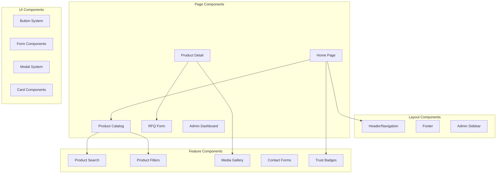
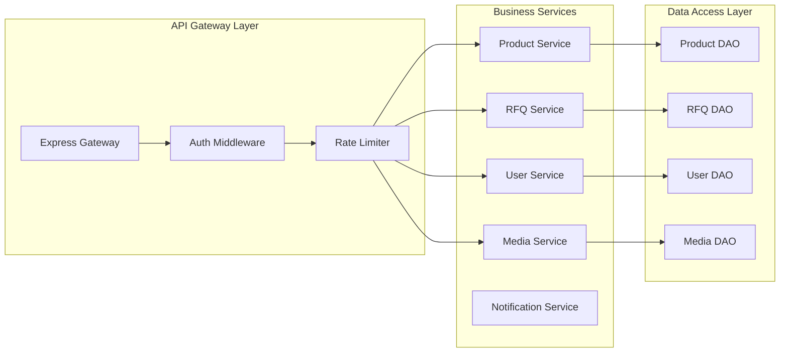
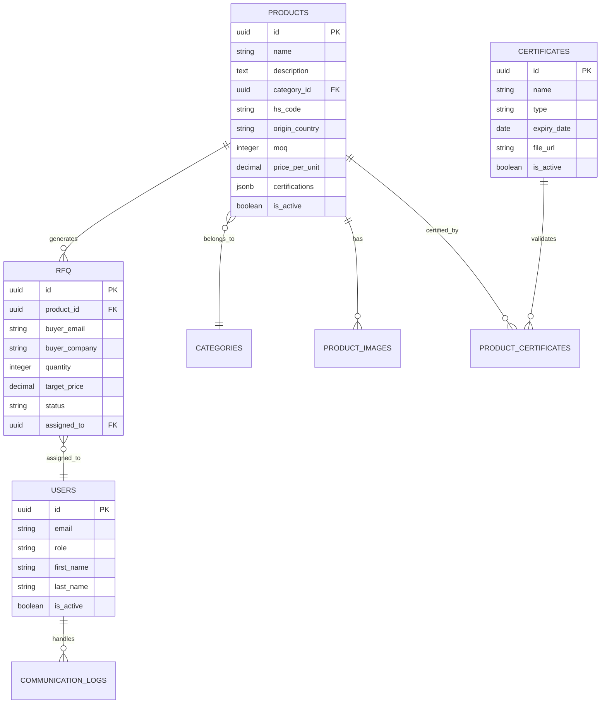

# Design Document: Agro Export Website Platform

## Overview

The Agro Export Website Platform is a modern, mobile-first B2B platform designed to connect agricultural exporters with international buyers. The system follows a headless architecture pattern with Next.js frontend and Node.js backend, optimized for performance, SEO, and international market reach.

The platform serves as a comprehensive digital storefront featuring product catalogs, RFQ management, compliance documentation, and multi-channel communication. The architecture prioritizes scalability, security, and user experience across diverse international markets.

## Architecture

### System Architecture Pattern

The platform implements a **Backend-for-Frontend (BFF)** pattern using Next.js API routes combined with a dedicated Node.js backend service. This hybrid approach provides:

- **Frontend**: Next.js 14+ with React 18, leveraging App Router for optimal SEO and performance
- **BFF Layer**: Next.js API routes handling frontend-specific logic, authentication, and data transformation
- **Backend Services**: Node.js/Express microservices for business logic, data processing, and third-party integrations
- **Database**: PostgreSQL with connection pooling for reliable data persistence
- **Cache Layer**: Redis for session management, API caching, and real-time features

### Deployment Architecture



### Security Architecture

- **HTTPS Everywhere**: TLS 1.3 encryption for all communications
- **Authentication**: JWT-based authentication with refresh token rotation
- **Authorization**: Role-based access control (RBAC) for admin functions
- **Input Validation**: Comprehensive validation using Zod schemas
- **Rate Limiting**: API rate limiting with Redis-backed counters
- **CSRF Protection**: Built-in Next.js CSRF protection
- **Content Security Policy**: Strict CSP headers for XSS prevention

## Components and Interfaces

### Frontend Components Architecture



### Backend Service Architecture



### Key Interface Definitions

**Product Catalog Interface**

```typescript
interface ProductCatalog {
  searchProducts(query: SearchQuery): Promise<ProductSearchResult>
  getProductById(id: string): Promise<ProductDetail>
  getProductsByCategory(category: string): Promise<Product[]>
  updateProduct(id: string, data: ProductUpdate): Promise<Product>
}

interface SearchQuery {
  term?: string
  category?: string
  origin?: string
  certification?: string[]
  priceRange?: PriceRange
  pagination: PaginationParams
}
```

**RFQ System Interface**

```typescript
interface RFQSystem {
  submitRFQ(rfq: RFQSubmission): Promise<RFQResponse>
  getRFQById(id: string): Promise<RFQDetail>
  updateRFQStatus(id: string, status: RFQStatus): Promise<void>
  exportRFQs(filters: RFQFilters): Promise<ExportData>
}

interface RFQSubmission {
  productId: string
  quantity: number
  targetPrice?: number
  deliveryLocation: string
  timeline: string
  buyerInfo: BuyerContact
  additionalRequirements?: string
}
```

**Communication Interface**

```typescript
interface CommunicationService {
  sendWhatsAppMessage(
    recipient: string,
    message: WhatsAppMessage
  ): Promise<void>
  sendEmail(
    recipient: string,
    template: EmailTemplate,
    data: any
  ): Promise<void>
  logCommunication(interaction: CommunicationLog): Promise<void>
}
```

## Data Models

### Core Entity Models

**Product Entity**

```sql
CREATE TABLE products (
    id UUID PRIMARY KEY DEFAULT gen_random_uuid(),
    name VARCHAR(255) NOT NULL,
    description TEXT,
    category_id UUID REFERENCES categories(id),
    hs_code VARCHAR(20),
    origin_country VARCHAR(2),
    moq INTEGER,
    unit VARCHAR(50),
    price_per_unit DECIMAL(10,2),
    packaging_details TEXT,
    certifications JSONB,
    images JSONB,
    compliance_docs JSONB,
    is_active BOOLEAN DEFAULT true,
    created_at TIMESTAMP DEFAULT NOW(),
    updated_at TIMESTAMP DEFAULT NOW()
);
```

**RFQ Entity**

```sql
CREATE TABLE rfqs (
    id UUID PRIMARY KEY DEFAULT gen_random_uuid(),
    product_id UUID REFERENCES products(id),
    buyer_name VARCHAR(255) NOT NULL,
    buyer_email VARCHAR(255) NOT NULL,
    buyer_phone VARCHAR(20),
    buyer_company VARCHAR(255),
    buyer_country VARCHAR(2),
    quantity INTEGER NOT NULL,
    target_price DECIMAL(10,2),
    delivery_location VARCHAR(255),
    timeline VARCHAR(100),
    additional_requirements TEXT,
    status VARCHAR(20) DEFAULT 'pending',
    priority VARCHAR(10) DEFAULT 'normal',
    assigned_to UUID REFERENCES users(id),
    created_at TIMESTAMP DEFAULT NOW(),
    updated_at TIMESTAMP DEFAULT NOW()
);
```

**User Entity**

```sql
CREATE TABLE users (
    id UUID PRIMARY KEY DEFAULT gen_random_uuid(),
    email VARCHAR(255) UNIQUE NOT NULL,
    password_hash VARCHAR(255) NOT NULL,
    role VARCHAR(20) DEFAULT 'admin',
    first_name VARCHAR(100),
    last_name VARCHAR(100),
    is_active BOOLEAN DEFAULT true,
    last_login TIMESTAMP,
    created_at TIMESTAMP DEFAULT NOW(),
    updated_at TIMESTAMP DEFAULT NOW()
);
```

**Certificate Entity**

```sql
CREATE TABLE certificates (
    id UUID PRIMARY KEY DEFAULT gen_random_uuid(),
    name VARCHAR(255) NOT NULL,
    type VARCHAR(50) NOT NULL,
    issuer VARCHAR(255),
    issue_date DATE,
    expiry_date DATE,
    certificate_number VARCHAR(100),
    file_url VARCHAR(500),
    file_size INTEGER,
    is_active BOOLEAN DEFAULT true,
    created_at TIMESTAMP DEFAULT NOW()
);
```

### Data Relationships



## Correctness Properties

_A property is a characteristic or behavior that should hold true across all valid executions of a system—essentially, a formal statement about what the system should do. Properties serve as the bridge between human-readable specifications and machine-verifiable correctness guarantees._

### Performance Properties

**Property 1: Page Load Performance**
_For any_ page request under normal network conditions, the complete page load time should be under 3 seconds and achieve Core Web Vitals compliance scores
**Validates: Requirements 1.1, 1.2**

**Property 2: Lazy Loading Optimization**
_For any_ page with media content, images and videos outside the initial viewport should not be loaded until they become visible or near-visible
**Validates: Requirements 2.4, 10.2**

**Property 3: Mobile Responsiveness**
_For any_ viewport size from 320px to 1920px width, all interface elements should be properly sized, accessible, and functional
**Validates: Requirements 1.4**

### Data Integrity Properties

**Property 4: RFQ Data Completeness**
_For any_ submitted RFQ, all required fields (product details, quantity, delivery location, timeline, buyer information) should be captured and stored correctly
**Validates: Requirements 3.1**

**Property 5: Product Information Completeness**
_For any_ product detail page, all mandatory product information (HS code, MOQ, packaging specifications, compliance documentation) should be displayed when available
**Validates: Requirements 2.2**

**Property 6: Certificate Validation**
_For any_ uploaded certificate, the system should validate file format, extract expiry date, and reject invalid documents with appropriate error messages
**Validates: Requirements 4.3**

### Search and Filter Properties

**Property 7: Product Search Relevance**
_For any_ search query, returned results should match the search criteria based on product name, category, or specifications, ordered by relevance
**Validates: Requirements 2.3**

**Property 8: Filter Accuracy**
_For any_ combination of product filters (category, origin, certification, price range), the results should include only products that match all selected criteria
**Validates: Requirements 2.1**

**Property 9: Certificate Search Functionality**
_For any_ search term in the certificate gallery, results should include only certificates whose name, type, or issuer contains the search term
**Validates: Requirements 4.1**

### Communication Properties

**Property 10: Notification Delivery**
_For any_ RFQ submission, both buyer acknowledgment email and admin panel notification should be triggered and delivered successfully
**Validates: Requirements 3.2, 3.3**

**Property 11: WhatsApp Context Preservation**
_For any_ WhatsApp contact initiation from a product page, the message should include relevant product information and buyer context
**Validates: Requirements 5.1**

**Property 12: Communication Logging**
_For any_ communication attempt (WhatsApp, email, phone), the interaction should be logged with timestamp, type, and relevant context for follow-up tracking
**Validates: Requirements 5.5**

### Security Properties

**Property 13: Form Protection**
_For any_ form submission, reCAPTCHA validation should be required and spam submissions should be blocked with appropriate error messages
**Validates: Requirements 9.1, 5.3**

**Property 14: Data Encryption**
_For any_ sensitive data (user credentials, personal information, business data), information should be encrypted both in transit (HTTPS) and at rest (database encryption)
**Validates: Requirements 1.5, 9.2**

**Property 15: Access Control**
_For any_ admin panel access attempt, proper authentication should be required and role-based permissions should be enforced based on user role
**Validates: Requirements 9.3**

**Property 16: Audit Trail Completeness**
_For any_ administrative action (content updates, user management, system configuration), the action should be logged with user ID, timestamp, and action details
**Validates: Requirements 9.4**

### Content Management Properties

**Property 17: Real-time Content Updates**
_For any_ content modification through the CMS, changes should be immediately visible on the public website without requiring manual deployment
**Validates: Requirements 2.5, 6.1**

**Property 18: Bulk Import Accuracy**
_For any_ CSV file uploaded for bulk product import, valid records should be processed successfully and invalid records should be reported with specific error details
**Validates: Requirements 6.3**

**Property 19: Version Control Integrity**
_For any_ content update, the previous version should be stored and available for rollback, maintaining complete change history
**Validates: Requirements 6.4**

### SEO and Internationalization Properties

**Property 20: Schema Markup Completeness**
_For any_ page with structured content (products, organization, contact), appropriate schema markup should be automatically generated and validated
**Validates: Requirements 7.1, 7.4**

**Property 21: Multi-language Consistency**
_For any_ supported language, content should be properly translated, hreflang tags should be correctly implemented, and language switching should preserve user context
**Validates: Requirements 7.3**

**Property 22: Country-specific Optimization**
_For any_ target market, country-specific landing pages should be generated with appropriate currency, language, and regulatory information
**Validates: Requirements 7.2**

### Analytics and Reporting Properties

**Property 23: Dashboard Metrics Accuracy**
_For any_ time period, dashboard metrics (RFQ counts, conversion rates, inquiry sources) should accurately reflect the underlying data and update in real-time
**Validates: Requirements 8.1, 8.5**

**Property 24: Export Data Integrity**
_For any_ lead export request, data should be accurately formatted in the requested format (CSV, Excel) and include all selected fields without corruption
**Validates: Requirements 8.2**

**Property 25: Report Generation Accuracy**
_For any_ report request (product interest, geographic distribution, inquiry trends), generated reports should accurately reflect the underlying data and be properly formatted
**Validates: Requirements 8.4**

### Media Management Properties

**Property 26: Media Gallery Functionality**
_For any_ media gallery, images should display with proper optimization, zoom functionality should work correctly, and videos should be playable across different devices
**Validates: Requirements 10.1, 10.4**

**Property 27: Image Optimization**
_For any_ uploaded image, the system should automatically compress, resize for different viewports, and generate appropriate formats while maintaining visual quality
**Validates: Requirements 10.3**

**Property 28: Media Accessibility**
_For any_ displayed media, appropriate alt text, captions, and accessibility descriptions should be provided to ensure WCAG 2.1 AA compliance
**Validates: Requirements 1.3, 10.5**

## Error Handling

### Error Classification System

The platform implements a comprehensive error handling strategy with categorized error types:

**Client Errors (4xx)**

- **400 Bad Request**: Invalid input data, malformed requests
- **401 Unauthorized**: Authentication required or failed
- **403 Forbidden**: Insufficient permissions for requested action
- **404 Not Found**: Requested resource does not exist
- **422 Unprocessable Entity**: Valid request format but business logic validation failed
- **429 Too Many Requests**: Rate limit exceeded

**Server Errors (5xx)**

- **500 Internal Server Error**: Unexpected server-side errors
- **502 Bad Gateway**: External service integration failures
- **503 Service Unavailable**: Temporary service outages or maintenance
- **504 Gateway Timeout**: External service timeout errors

### Error Response Format

All API errors follow a consistent JSON structure:

```typescript
interface ErrorResponse {
  error: {
    code: string
    message: string
    details?: any
    timestamp: string
    requestId: string
  }
}
```

### Error Handling Strategies

**Frontend Error Handling**

- **Network Errors**: Automatic retry with exponential backoff
- **Validation Errors**: Real-time field validation with user-friendly messages
- **Authentication Errors**: Automatic token refresh or redirect to login
- **Rate Limiting**: User-friendly messages with retry suggestions

**Backend Error Handling**

- **Database Errors**: Connection pooling with failover mechanisms
- **External API Failures**: Circuit breaker pattern with fallback responses
- **File Upload Errors**: Comprehensive validation with detailed error messages
- **Email Delivery Failures**: Queue-based retry mechanism with dead letter handling

**Monitoring and Alerting**

- **Error Rate Monitoring**: Real-time error rate tracking with threshold alerts
- **Performance Monitoring**: Response time and availability monitoring
- **Business Logic Errors**: Custom alerts for critical business process failures
- **Security Incident Detection**: Automated alerts for suspicious activity patterns

## Testing Strategy

### Dual Testing Approach

The platform employs both unit testing and property-based testing for comprehensive coverage:

**Unit Testing Focus**

- Specific business logic examples and edge cases
- Integration points between components
- Error condition handling and recovery
- Authentication and authorization flows
- External API integration mocking

**Property-Based Testing Focus**

- Universal properties that hold across all inputs
- Data validation and transformation correctness
- Search and filter functionality across diverse datasets
- Performance characteristics under various load conditions
- Security properties across different attack vectors

### Property-Based Testing Configuration

**Testing Framework**: Fast-check for JavaScript/TypeScript property-based testing

- **Minimum Iterations**: 100 iterations per property test
- **Shrinking Strategy**: Automatic input minimization for failed test cases
- **Custom Generators**: Domain-specific generators for products, RFQs, and user data

**Test Tagging Convention**
Each property-based test includes a comment referencing the design document property:

```typescript
// Feature: agro-export-platform, Property 1: Page Load Performance
```

**Coverage Requirements**

- **Unit Tests**: Minimum 80% code coverage for business logic
- **Property Tests**: All 28 correctness properties must be implemented
- **Integration Tests**: End-to-end workflows for critical user journeys
- **Performance Tests**: Load testing for concurrent user scenarios

### Test Data Management

**Test Data Strategy**

- **Synthetic Data Generation**: Faker.js for realistic test data
- **Database Seeding**: Consistent test database states
- **File Upload Testing**: Various file types and sizes for media testing
- **Internationalization Testing**: Multi-language content validation

**Test Environment Management**

- **Isolated Test Databases**: Separate databases for each test suite
- **External Service Mocking**: Mock implementations for WhatsApp API, email services
- **Performance Test Environment**: Dedicated environment for load testing
- **Security Testing**: Automated security scanning and penetration testing

This comprehensive testing strategy ensures both functional correctness and performance reliability across all platform components while maintaining rapid development velocity through automated validation.
